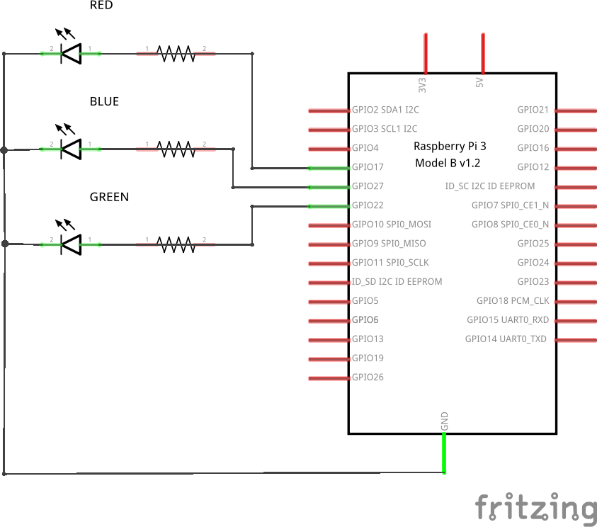

# rpi-leds
Control rgb leds strips through a web browser with a raspberry pi.


## Usage 
By default, leds are extincts.
Simply navigate to \<device-ip\>/leds.php and select a color. 


## Installation

If you want a lot of stability, you'll need to download the code from the release section.

### docker
You should have a raspbian running on your pi.

You must install docker-ce and docker-compose.

Clone the repositorie :
```bash
git clone https://github.com/manuxviii/rpi-leds.git
cd rpi-leds
```

Switch to branch docker : 
```git
git checkout docker
```

Depending on your installation, docker might require super user rights. 
Build :
```bash
docker-compose build
```

Launch :
```bash
docker-compose up -d
```

*If needed, prebuild images are disponible on the docker hub : manuxviii/rpi-leds and manuxviii/rpi-leds_web. Simply add the docker-compose.yaml from the git.*

### balena
Simply clone the repository then push to your project :
```bash
git clone https://github.com/manuxviii/rpi-leds.git
balena push <project>
```

### Others
Dependancies :
  - a running webserver with php
  - python3 with the requests and RPi.GPIO modules

Copy the leds.php to the root of your webserver. Then, launch the leds.py file.


## Wiring
If you want to modify the used pins, you should modify the PINs variable in leds.py.
Raspberry pi power is limited. For a great amount of leds, a relay must be used between the pi and the leds.

Here is the schematics :



## Versions
### v1.0 (Released)
Current version.
Leds can display a single color. Fonctionnal web interface.

### v2.0 (wip)
Programmable shows.
Fading and flashing effects.

### v3.0 (not in work)
Fully pogrammable shows.
Possibility of saving shows and load them quickly.

### v3.5 (not in work)
Possibility to control different leds strip independantly.

### v4.0 (not in work)
Android app other wifi
